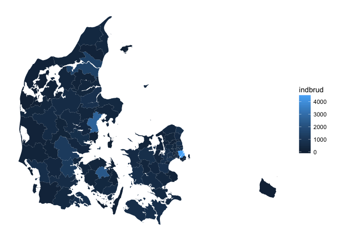
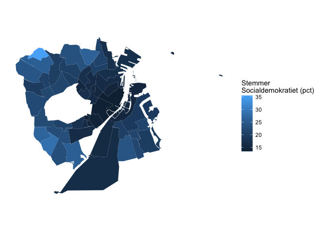
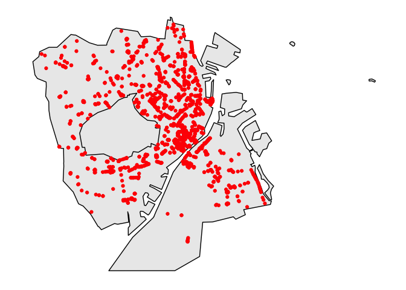
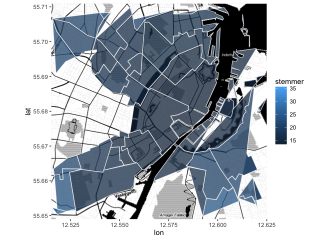

<!-- README.md is generated from README.Rmd. Please edit that file -->
This is a package for making easy maps of Denmark.

Currently, the package allows you to do three things:

1.  make basic maps of Denmark
2.  turn these maps into (static) choropleth maps
3.  plot longitude-latitude points on a map of Denmark

To create a basic map of Denmark at the municipality level simply run

``` r
library(mapDK)
mapDK()
```

 

You can control the level of the map by specifying the `detail` argument. Currenty, `mapDK` accepts the following arguments

-   `municipality` - plots Denmark's 98 municipalities
-   `region` - plots Denmark's 5 regions
-   `rural` - plots Denmark's 11 rural areas
-   `zip` - plots Denmark's 598 zip code areas
-   `polling` - plots Denmark's 1385 polling places (as of 2015)
-   `parish` - plots Denmark's 1931 parishes

Choropleth Maps
---------------

`mapDK` also allows you to create static choropleth maps using either the package's build in datasets, or new datasets provided by the user.

### Plot Municipality Level Data

To create a static choropleth map at the municipality level we can use some data about burglaries in Denmark (included in the package).

One creates a choropleth map simply by specifying the values and id's (as strings) and the dataset in the call to `mapDK`

``` r
mapDK(values = "indbrud", id = "kommune", data = crime)
```

 

If you don't provide names for all municipalities, the function will throw a warning.

Plot Polling Place Data
-----------------------

You can create cool maps of election results at the polling place level by specifying `detail = "polling"`. The package includes a dataset of Danish general election 2011 results at the polling level. Below, we plot Socialdemokratiets election results in percent at each available polling place in the map dataset

``` r
mapDK(values = "stemmer", id = "id", 
  data = subset(votes, navn == "socialdemokratiet"),
  detail = "polling", show_missing = FALSE,
  guide.label = "Stemmer \nSocialdemokratiet (pct)")
```

 

Say you only want to plot Socialdemokratiets votes in Copenhagen. That's easily done using the `sub.plot` option

``` r
mapDK(values = "stemmer", id = "id", 
  data = subset(votes, navn == "socialdemokratiet"),
  detail = "polling", show_missing = FALSE,
  guide.label = "Stemmer \nSocialdemokratiet (pct)",
  sub.plot = "koebenhavn")
```

 

Plot points on a map of Denmark
-------------------------------

You can provide your own data set of longitude-latitude points (in WGS84) and plot them on a map of Denmark using the `pointDK` function. Below, I plot a data set of benches in Copenhagen available in the package

``` r
pointDK(benches, sub = "koebenhavn", point.colour = "red")
```

 

You can also plot values in your data by specifying a `values` column

``` r
benches$mydata = 1:nrow(benches) # create values
pointDK(benches, values = "mydata", detail = "polling", sub.plot = "koebenhavn", point.colour = "red",
       aesthetic = "colour")
```

 

The getID function
------------------

The `getID` function allows you to print the map key. Running this before plotting your dataset with `mapDK` is probably a good idea.

`getID` accepts only one argument, `detail`, and using it is as easy as (it returns keys for municipalities if nothing else is specified)

``` r
getID()[1:10]
#>  [1] "aabenraa"    "aalborg"     "aeroe"       "albertslund" "alleroed"   
#>  [6] "aarhus"      "assens"      "ballerup"    "billund"     "bornholm"
```

Say you want the names of the parishes instead, just run `mapDK(detail = "parish")`.

`mapDK` and `ggmap`
-------------------

The functions in `mapDK` work nicely with `ggmap`. Below is an example

``` r
library("ggmap")
library("dplyr")
votes.cph.shape = mapDK::polling %>% filter(KommuneNav == "koebenhavn") %>% left_join(mapDK::votes)
cph.map = ggmap(get_map(location = c(12.57, 55.68), 
                       source = "stamen", 
                       maptype = "toner", crop = TRUE,
                       zoom = 13))
cph.map + 
  geom_polygon(data = subset(votes.cph.shape, navn == "socialdemokratiet"), 
                       aes(x = long, y = lat,
                           group = group, fill = stemmer),
                       alpha = .75) 
```


